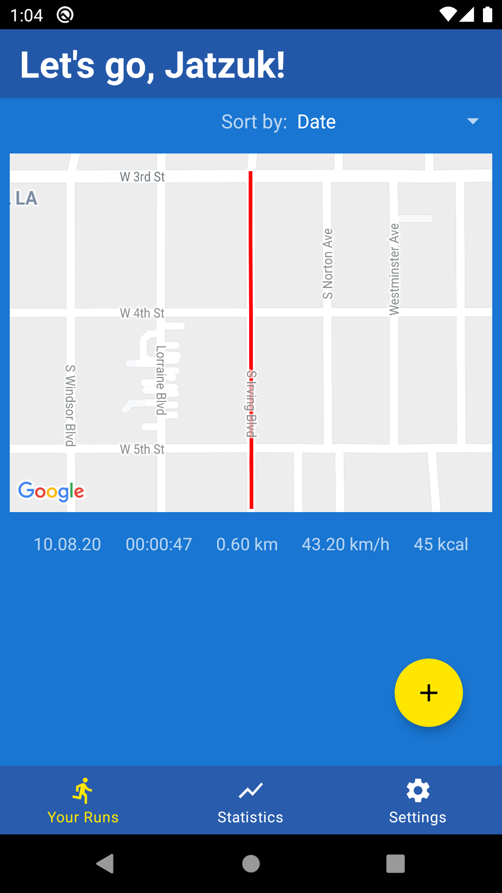
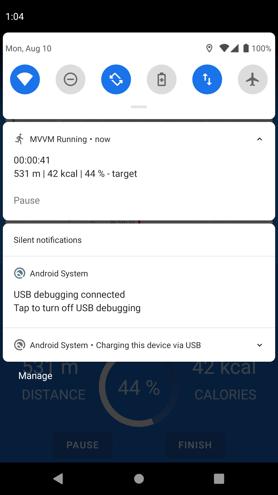
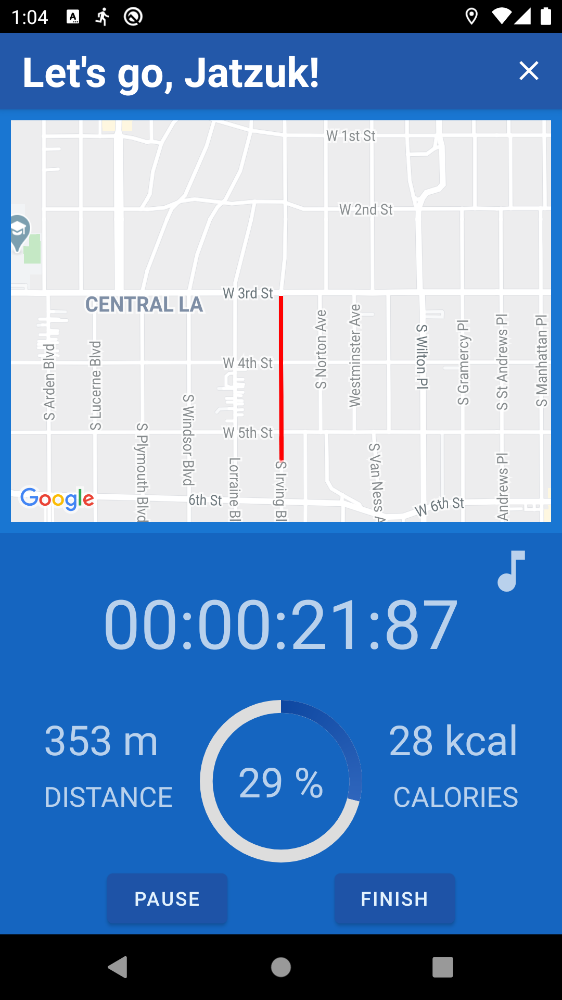
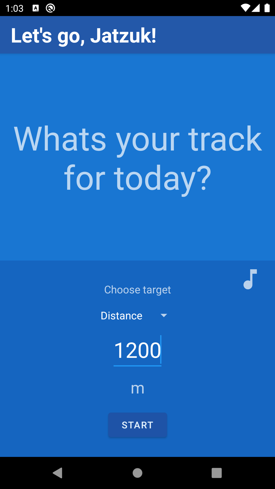

# MVVM Running App

## A simple study-project to demonstrate my technology stack

## Technologies and libraries

- [MVVM](https://developer.android.com/jetpack/guide)
- [HILT](https://developer.android.com/training/dependency-injection/hilt-android)
- [Room](https://developer.android.com/training/data-storage/room)
- [MPAndroidChart](https://github.com/PhilJay/MPAndroidChart)
- [Glide](https://github.com/bumptech/glide)
- [Easypermissions](https://github.com/googlesamples/easypermissions)
- [Material design](https://material.io/develop/android)
- [Coroutines](https://developer.android.com/kotlin/coroutines)
- [Navigation](https://developer.android.com/guide/navigation)
- [Google Maps SDK](https://developers.google.com/maps/documentation/android-sdk/overview)
- [Timber](https://github.com/JakeWharton/timber)
- [Motion Layout](https://developer.android.com/training/constraint-layout/motionlayout)

  

## Thanks

[Original idea and base app](https://github.com/androiddevs18/RunningApp)
