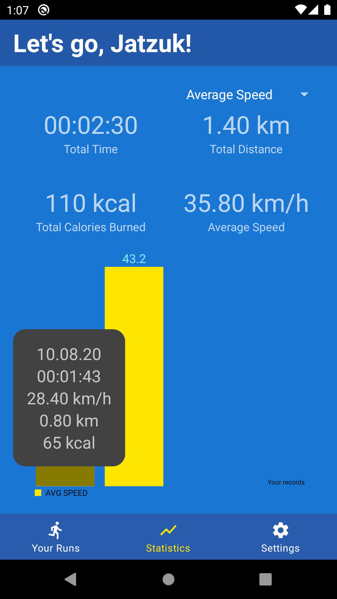

# MVVM Running App

## A simple study-project to demonstrate my technology stack

## Technologies and libraries

- MVVM
- HILT
- Room
- MPAndroidChart
- Glide
- easypermissions
- material design
- coroutines
- navigation components
- Google Maps
- Timber
- Motion Layout

## Thanks

[Original idea and base app:](https://github.com/androiddevs18/RunningApp)
